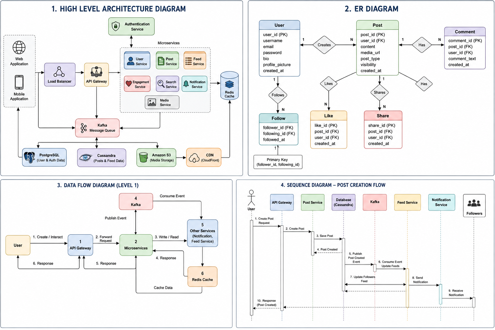

# News Feed System - High Level Design

## Project Overview

This project presents the High-Level Design (HLD) of a scalable News Feed System similar to Facebook, Instagram, and Twitter.

The proposed architecture is designed to support millions of users while ensuring high scalability, availability, fault tolerance, and low latency.

---

## Features

- User Registration & Authentication
- User Profile Management
- Follow / Unfollow Users
- Create Text, Image & Video Posts
- Personalized News Feed
- Like, Comment & Share Posts
- Search Users & Posts
- Trending Feed
- Notifications

---

## Project Structure

```
NewsFeedSystem-HLD
│
├── README.md
├── docs
│   ├── HLD.md
│   └── Technical_Design.md
│
├── api
│   └── API.md
│
├── images
│   ├── architecture.png
│   ├── er_diagram.png
│   ├── data_flow.png
│   └── sequence_diagram.png
│
└── implementation
    └── README.md
```

---

## Technology Stack

- Java / Spring Boot
- REST APIs
- PostgreSQL
- Cassandra
- Redis
- Apache Kafka
- Amazon S3
- CDN
- Docker
- Kubernetes

---

# Documentation

| Document | Description |
|----------|-------------|
| HLD.md | High-Level System Design |
| Technical_Design.md | Scalability, Security, Reliability & Design Decisions |
| API.md | REST API Documentation |

---

## System Architecture and Design Diagrams

The following diagram illustrates the overall architecture, database design, data flow, and sequence of operations in the proposed News Feed System.



# Scalability Highlights

- Microservices Architecture
- Redis Distributed Cache
- Apache Kafka Messaging
- Cassandra for High Write Throughput
- PostgreSQL for Relational Data
- CDN for Media Delivery
- Hybrid Feed Generation Strategy

---

# Future Enhancements

- AI-based Feed Ranking
- Push Notifications
- Live Streaming
- Story Feature
- Video Reels
- Machine Learning-based Recommendations


---

# Conclusion

This repository demonstrates the High-Level Design of a scalable News Feed System using modern distributed system principles. The proposed architecture emphasizes scalability, reliability, security, and maintainability, making it suitable for large-scale social networking platforms.


# Author

**Avanthika**